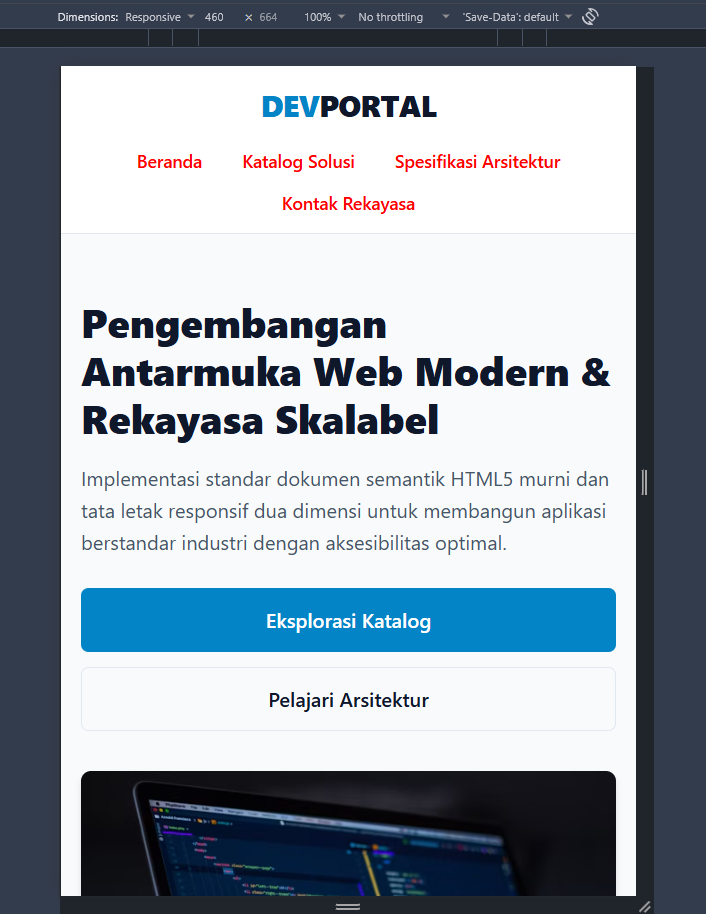
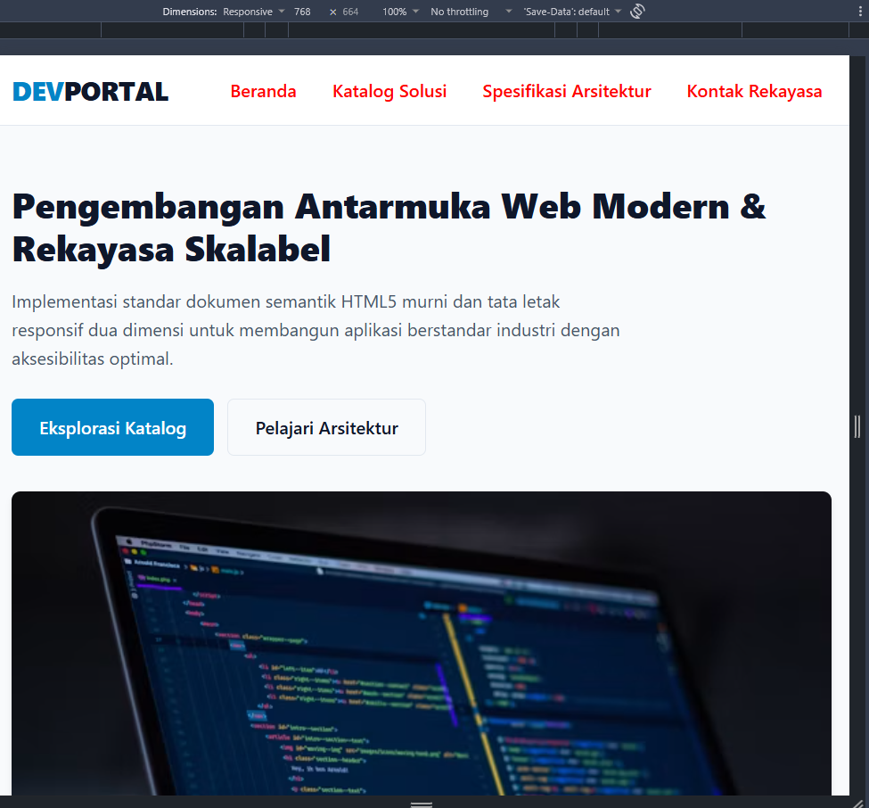
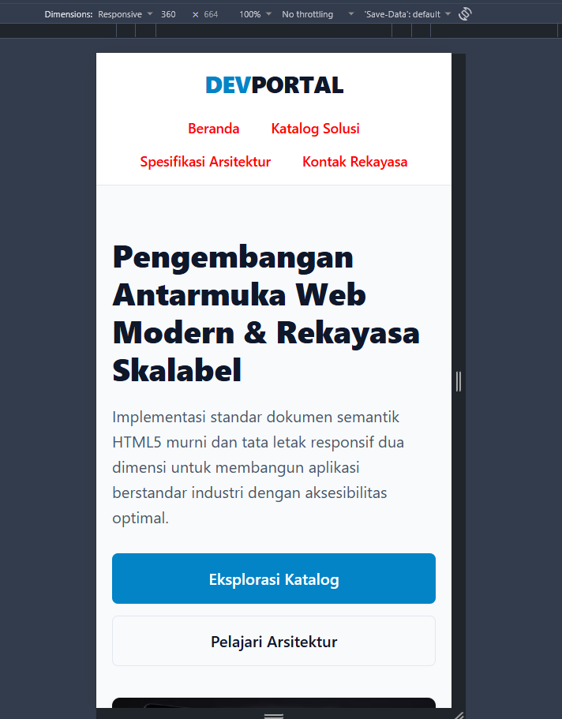
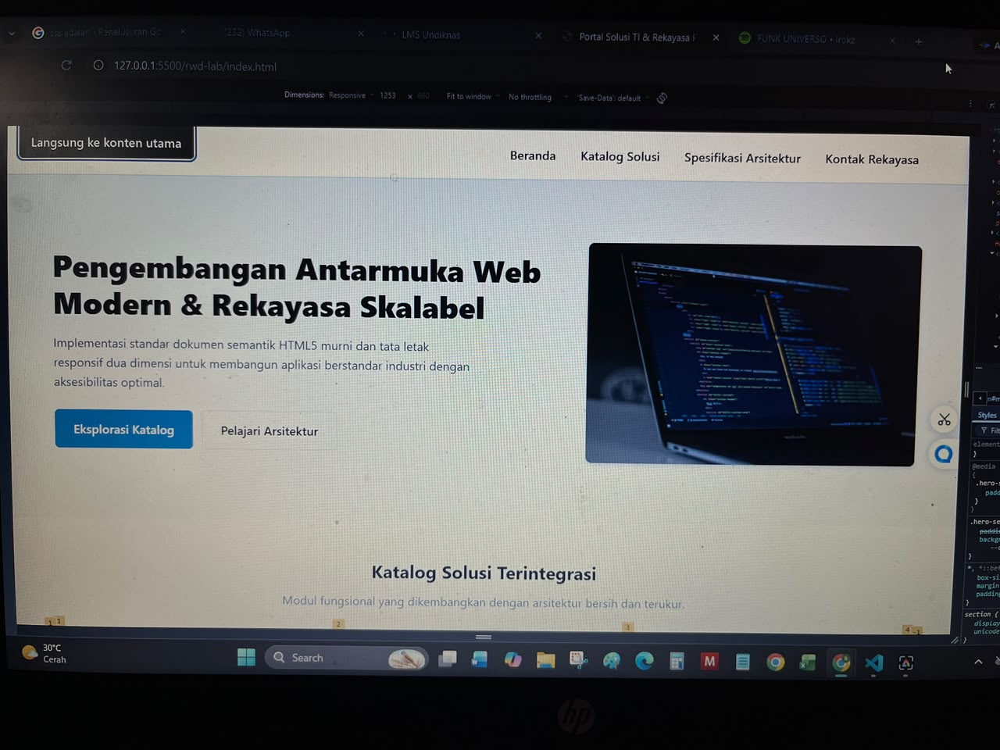

# Laporan Praktikum Responsive Web Design (RWD)

Dokumentasi dan logbook pengujian integritas kode untuk laboratorium pemrograman web modern.

Creator : Gede Bagus Indra Tanaya (42530034)

---

## 📋 Matriks Penelusuran Pengujian (Traceability Matrix)

Berikut adalah catatan hasil pengujian tampilan antarmuka dan responsivitas aplikasi pada berbagai ukuran layar (*viewport*):

| ID Uji | Fitur / Komponen | Lebar Viewport Pengujian | Ekspektasi Tampilan Antarmuka | Hasil Pengujian Aktual | Status (Pass/Fail) | Bukti Tanggap Layar |
| :---: | :--- | :--- | :--- | :--- | :---: | :---: |
| **TC-01** | Navigasi Menu | Mobile (360px – 480px) | Menu membungkus (*wrap*) rapi, tidak terpotong, teks terbaca proporsional | Sesuai ekspektasi | **Pass** |  |
| **TC-02** | Hero Section | Breakpoint Tablet (768px) | Berubah dari susunan 1 kolom vertikal menjadi tata letak seimbang | Sesuai ekspektasi | **Pass** |  |
| **TC-03** | Grid Katalog | Resize Dinamis (360px – 1920px) | Kolom bertambah otomatis secara *fluid* tanpa kemunculan *horizontal scrollbar* | Sesuai ekspektasi | **Pass** |  |
| **TC-04** | Navigasi Keyboard | Papan Ketik (Tombol Tab) | *Skip-link* muncul di sudut kiri atas saat menerima fokus | Sesuai ekspektasi | **Pass** |  |

---

## 🛠️ Catatan Perbaikan & Investigasi Kode

### 1. Penanganan Flexbox & Grid Overflow
- **Penyebab:** Elemen kartu sempat melebar akibat *string token* panjang tanpa spasi.
- **Solusi:** Menambahkan `min-width: 0` pada `.product-card` dan `overflow-wrap: anywhere` pada teks paragraf.

### 2. Penyelesaian Margin Collapse
- **Penyebab:** Kebocoran margin atas pada judul `.hero-section__title`.
- **Solusi:** Menerapkan pembentukan *Block Formatting Context* (BFC) baru menggunakan `display: flow-root` / `overflow: clip` pada elemen induk `.hero-section`.

### 3. Perbaikan Spesifisitas CSS (BEM Method)
- **Penyebab:** Efek `:hover` gagal bekerja akibat *over-qualification* selektor rantai (`header nav ul li a`).
- **Solusi:** Menyederhanakan selektor menggunakan kelas BEM murni `.primary-nav__link` dan `.primary-nav__link:hover` tanpa rantai tag HTML.

---

## 🚀 Cara Menjalankan Proyek

1. *Clone* repositori ini:
   ```bash
   git clone https://github.com/gusinpng/PRATIKUM_PEMROGRAMAN_WEB_GUSIN.git
2. *Masuk* kedalam folder
    ```bash
   cd rwd-lab
3. *Buka* project
    ```bash 
    code . 
    ```
4. *View* project 
    ```bash
    live server
    ```